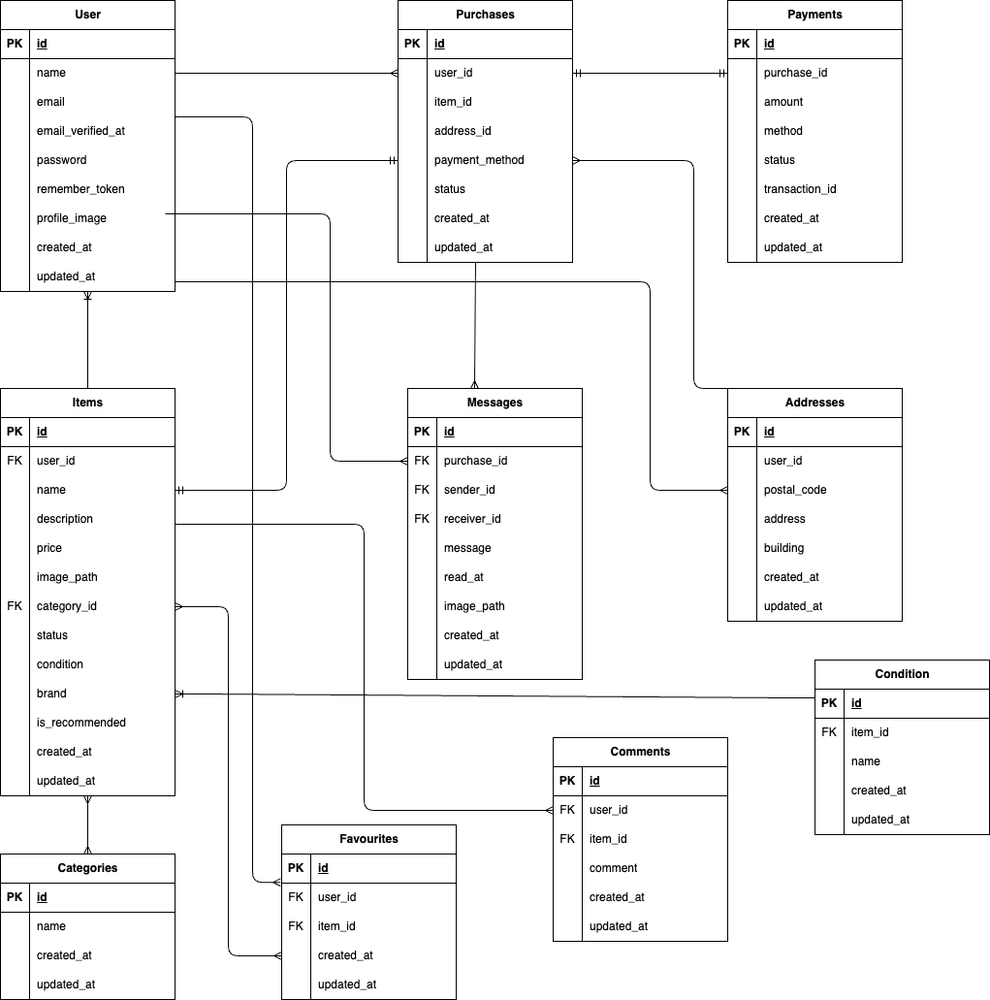

# フリマサイト（模擬案件）

## 環境構築
Dockerビルド
1. git clone git@github.com:k-sakata1988/freemarketsite_mogianken.git
2. DockerDesktopアプリを起動
3. docker-compose up -d --build

Laravel環境構築
1. docker-compose exec php bash
2. composer install
3. .env.exampleファイルから.envを作成し、環境変数を変更(mysql,laravel_db,laravel_user,laravel_passに設定)
4. php artisan key:generate
5. php artisan migrate
6. php artisan db:seed
7. docker run -d -p 1025:1025 -p 8025:8025 mailhog/mailhog

## 使用技術
- PHP 8.1.33
- Laravel 8.83.8
- MySQL 8.0.26
- Nginx 1.21
- Docker 28.3.2 /Docker Compose 3.8

## ER図

## URL
- 開発環境: http://localhost/
- phpMyAdmin: http://localhost:8080/